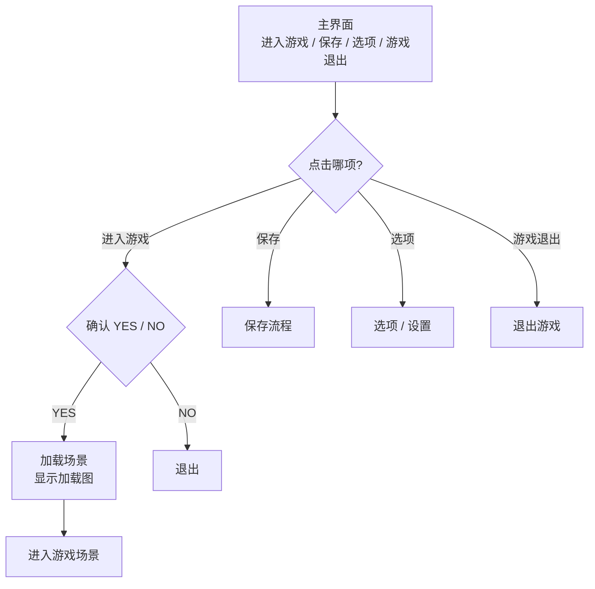

# VRgame · 主界面流程（定稿草案）

> 视觉：古剑奇谭风格 UI（墨青底 · 暖金描边 · 月白正文）  
> 按钮：进入游戏 · 保存 · 选项 · 游戏退出

```mermaid
flowchart TD
  A[主界面<br/>进入游戏 / 保存 / 选项 / 游戏退出] --> B{点击哪项?}
  B -->|进入游戏| C{确认 YES / NO}
  C -->|YES| D[加载场景<br/>显示加载图]
  D --> E[进入游戏场景]
  C -->|NO| F[退出]
  B -->|保存| G[保存流程]
  B -->|选项| H[选项 / 设置]
  B -->|游戏退出| I[退出游戏]
```
