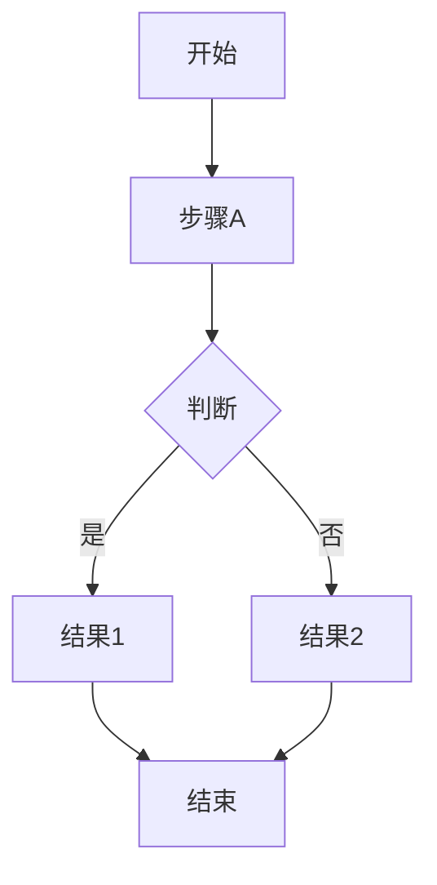
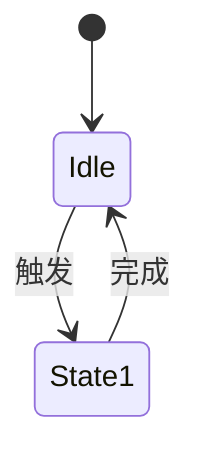

# UI / 玩法逻辑流程图（空白模板）

复制下面代码块，改文字即可。可用编辑器预览 Mermaid，或发回本岗代存。

## 流程模板

```mermaid
flowchart TD
  Start[开始] --> A[步骤A]
  A --> B{判断}
  B -->|是| C[结果1]
  B -->|否| D[结果2]
  C --> End[结束]
  D --> End
```

## 状态机模板（可选）

```mermaid
stateDiagram-v2
  [*] --> Idle
  Idle --> State1: 触发
  State1 --> Idle: 完成
```

## 用法

1. 复制对应代码块  
2. 只改方框/菱形里的中文  
3. 需要分支就复制一行 `X -->|条件| Y`  
4. 保存为 `docs/逻辑_你的标题.md` 或发回 UI 美术归档
